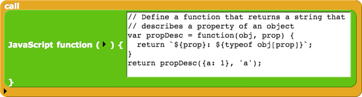

# znap!

I've been playing around a little bit with 
[Snap!](http://snap.berkeley.edu/snapsource/snap.html). This is a sandox to 
try out some ideas for a more functional-programming oriented way of doing
graphics and animations.

# Running the server

Clone the [`Snap!` repo](https://github.com/jmoenig/Snap--Build-Your-Own-Blocks)
into the `snap` subdirectory here, and then enter:

```
./run-server.sh
```

I am developing using a fork of the Snap! repo, but haven't found it necessary
to override anything yet. I'm using proxying to overlay ZBlocks on top of 
the Snap! repository.


# ZBlocks code

Is in ZBlocks.js here.

# Design

* All function blocks (all blocks?) are reporters; there are no "step" blocks.
* No mutations -- all "setter-type" blocks return a copy.

* The display window is an immutable object which is a view into a complex
  data structure that describes the states of things as a function of time.

* Example: "glide 5 steps in 1 second":
    * Returns a new sprite-view object, which is a chain of views,
    * The latest being:
        * time-translation such that t=0 relative to the end time of the
          previous sprite-view in the chain
        * likewise, position-translation
        * a function relating position to time: x = 5t
    * The return value of this function can be chained to the next 
      sprite-view.

- graphical contexts - most generally, any graphical context is a chain of
  general coordinate transformations.
- transformations can be general, but the most common ones are
    - linear (e.g. constant motion)
    - geometric (e.g. steadily increasing scale)
    - cyclic (steadily changing direction, hue, etc.)


* Example: spiral (of any underlying shape)
    - A GC that defines a steady increase in scale with time,
    - wrapping any kind of continuous cyclic drawing


* sprite-view
    * It's really a graphical context. More specifically, a set of graphical
      contexts, since different parts of the sprite can have different 
      transformation rules,
    * All sprite-views are relative. The state variables, like time, position,
      scale, etc., accumulate. So all methods for those have to be given a
      reference sprite-view, which is one that exists previous to the current
      one in scope.
    * The window itself supplies the "background" sprite view

    * properties / methods:
        * end-time - (optional) - this should be interpreted as: if there's 
          a following-sibling, then this is the time at which that sibling's
          state takes precedence over this one's
        * position: this should be stored in a generic format, with setters and
          getters for various coordinate systems.
        * Current time and distance scales, relative to any preview view.
        * calculator functions for distances, durations, etc.

    * Structure: chained and nested
        * chaining describes a sequence of "actions", one following another.
          Each next one takes that previous one's last state as its starting
          point
        * nesting allows an over-arching scale, duration, or other 
          transformation to be applied to a child sequence. This is really a
          "graphical context".


Start simple: chained (no nesting); and only (x,y) position. No color, scale,
time-translations, or anything.

Implementation:

* sv-atom - an object. Think of it like a list. It can be assigned to a 
  variable. We'll have separate blocks for each of its methods.

* sv-list - a list of sv-atoms. These are not recursively nested -- they are
  always flattened.


* Need a generic mechanism for defining a class:
    * a block: `new class` that returns a function
    * The function is the "global class method", that takes one list argument


# Javascript blocks

I saved a project called `zblocks`, where I was playing with defining 
JavaScript function blocks. For example:



I created blocks for each of the following.
I really like this style of "one function at a time, with tests". But it
doesn't make sense to do all of this inside of snap blocks.
So, I'm venturing to do it in zblocks.js.


```javascript
// Can return a Snap! list object
return new List(['y!', 'z!'])
```

```javascript
// Can return a JS object as a list item
const propDesc = { name: 'zzzz' };
return new List(['y!', propDesc]);
```

```javascript
// Yes, Snap! uses the toString() method to
// display the list items values
var propDesc = { name: 'zzzz' };
propDesc.toString = function(pd) { return 'floob'; };
return new List(['y!', propDesc]);
```

```javascript
// !! Cannot JSON.stringify the sprite!
// Because circular.
var sprite = this;
return JSON.stringify(sprite);
```

```javascript
// Define a function that returns a string that
// describes a property of an object
var propDesc = function(obj, prop) {
  return `${prop}: ${typeof obj[prop]}`;
}
return propDesc({a: 1}, 'a');
```

```javascript
// List all the property names of the sprite
var sprite = this;
var sprops = Object.keys(sprite).sort();
return new List(sprops);
```

```javascript
// Parially apply propDesc
var sprite = this;
var propDesc = function(obj, prop) {
  return `${prop}: ${typeof obj[prop]}`;
}
var spriteDesc = function(prop) {
  return propDesc(sprite, prop);
}
return spriteDesc('heading');
```

```javascript
// Describe all the properties of the sprite
var sprite = this;
var propDesc = function(obj, prop) {
  return `${prop}: ${typeof obj[prop]}`;
}
var spriteDesc = function(prop) {
  return propDesc(sprite, prop);
}
var sprops = Object.keys(sprite).sort()
  .map(spriteDesc);
return new List(sprops);
```

