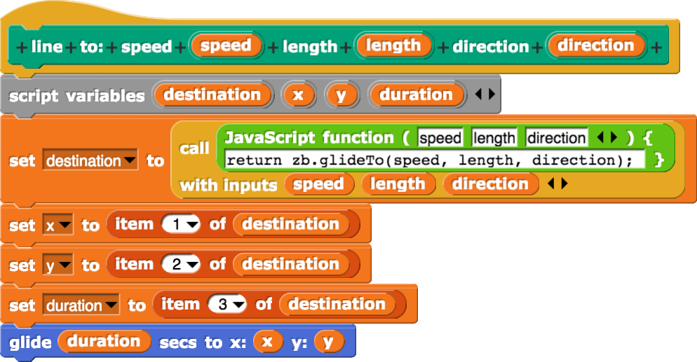

# Milestones

## [square-spiral-v1]()

This is a simple square spiral generated by the sprite as it communicates
with "zbman", which is loaded by a script tag. To run it:

* Check out the repo at that tag
* Start `./run-servers.sh`
* Make sure you've cloned the `Snap!` repo into the "snap/" subdirectory
  (this was before I had it as a submodule) as commit
  f1d91d1.
* Bring up http://localhost:8756
* Go to File -> Open, and then pick zblocks2 from the "projects" directory
  here.

I uses two blocks:

line-to:



Every time this gets invoked, it calls zbman to figure out where it's *really*
supposed to go.


```javascript
// Move to an event in the future.
// Input: relative-coordinates: where are we moving to
// Output: real-coords: relative time, absolute coords.
glideTo(vspeed, vlength, vdirection) {
  console.log('=================> glideTo');
  // If this is called before the zblocks constructor, set these points
  // to the origin.
  if (!('v0' in zb) || !typeof zb.v0 === 'object') zb.v0 = zb.ORIGIN;
  const v0 = zb.v0;
  if (!('r0' in zb) || !typeof zb.v0 === 'object') zb.r0 = zb.ORIGIN;
  const r0 = zb.r0;

  const vdir = degToRad(vdirection);
  const dvx = vlength * Math.sin(vdir);
  const dvy = vlength * Math.cos(vdir);
  const vduration = vlength / vspeed;
  console.log('=================> glideTo A');
  const v1 = {
    x: v0.x + dvx,
    y: v0.y + dvy,
    t: v0.t + vduration,
  };
  console.log('=================> glideTo B');

  // compute the real coords, and the return value from this function
  const r1 = v2r(v1);
  console.log('r1: ', r1);
  console.log('r0: ', r0);
  const ret = { x: r1.x, y: r1.y, dt: r1.t - r0.t, };
  console.log('ret: ', ret);

  // Now update the simulator
  zb.v0 = v1;
  zb.r0 = r1;
  console.log('v0: ', zb.v0);

  //return ret;
  // rx1, ry1, 
  return new List([ret.x, ret.y, ret.dt]);
};
```
